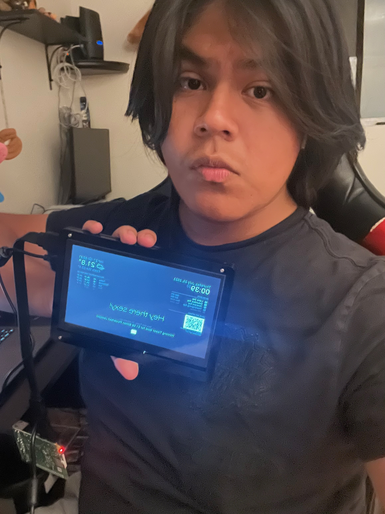

# Gerardo's Project
My project was a smart mirror. I had to connect a display to a raspberry pi which was my first time using one. I used it to run the base code for my smart mirror then made a case to hold the display. I mainly stuggled with coding and inputing commands. I didn't understand much of the steps I would see online so asking for help from instructors was key. I completed my project up to the case which holds my lcd display and I like how my smart mirror templates looks.


```HTML 

```

| **Engineer** | **School** | **Area of Interest** | **Grade** |
|:--:|:--:|:--:|:--:|
| Gerardo G | John H. Francis Polytechnic | Areospace Engineering | Incoming Senior



  
# Final Milestone


<iframe width="560" height="315" src="https://www.youtube.com/embed/-YQCNUtFIGc" title="YouTube video player" frameborder="0" allow="accelerometer; autoplay; clipboard-write; encrypted-media; gyroscope; picture-in-picture; web-share" allowfullscreen></iframe>

- For my my final milestone I have added my case for my display which makes adding other things much easier so while I don't have the mirror my final template for the display is good
- Getting to this step was really acomplishing as I struggled with the code a lot and would constalty mess up my whole template for the mirror but anyway I added and fixed modules or existing modules and have everything I want in my code for the mirror
- this program has let me learn the issues you can face in this field and where my strengths are and what i need to work on more. This project specifcally taught me that coding and knowing more about the coding vocabulary and overall terms and knowledge is very important for engineers


# Second Milestone

<iframe width="560" height="315" src="https://www.youtube.com/embed/4OVFgq1mOQk" title="YouTube video player" frameborder="0" allow="accelerometer; autoplay; clipboard-write; encrypted-media; gyroscope; picture-in-picture; web-share" allowfullscreen></iframe>

- For my second milestone I have added more modules that do actions like connect people to my wifi or ask trivia questions. 
I also setup the correct time and weather from the base template.
-The third party module integration was diffucult as I had trouble with the code and certain modules. I got through this by refering to the base code at all times to make sure I wasn't messing up the main code.
- The third party modules got easier to integrate the more I added as the process is usally the same. 
-I now have to just add on the actual mirror on the display and make sure the smart part of the mirror is visable through the mirror.

# First Milestone


<iframe width="560" height="315" src="https://www.youtube.com/embed/e35GBWoYg5E" title="YouTube video player" frameborder="0" allow="accelerometer; autoplay; clipboard-write; encrypted-media; gyroscope; picture-in-picture; web-share" allowfullscreen></iframe>

- For my first milestone I set up my magic mirror software and the display with the raspberry pi
- Initially I was confused with where to start but once I figured that out everything went pretty smooth
- I set up the code for the magic mirror following the guide on Magic Mirror builders for raspberry pie and connected my display to my raspberry pi so I could actually see the magic mirror base template
- After this I still have to add more modules and actually set up the pyschical mirror on the display.

# Schematics 
Here's where you'll put images of your schematics. [Tinkercad](https://www.tinkercad.com/blog/official-guide-to-tinkercad-circuits) and [Fritzing](https://fritzing.org/learning/) are both great resoruces to create professional schematic diagrams, though BSE recommends Tinkercad becuase it can be done easily and for free in the browser. 

# Code

```c++
void setup() {
  // put your setup code here, to run once:
{
			module: "alert",
		},
		{
			module: "updatenotification",
			position: "top_bar"
		},
		{
			module: "clock",
			position: "top_left"
		},
		{
			module: "calendar",
			header: "US Holidays",
			position: "top_left",
			config: {
calendars: [
					{
						fetchInterval: 7 * 24 * 60 * 60 * 1000,
						symbol: "calendar-check",
						url: "https://ics.calendarlabs.com/76/mm3137/US_Holidays.ics"
					}
				]
			}
		},
		{
			module: "compliments",
			position: "lower_third"
		},
		{
			module: "weather",
			position: "top_right",
			config: {
				weatherProvider: "openweathermap",
				type: "current",
				location: "New York",
				locationID: "5128581", //ID from http://bulk.openweathermap.org/sample/city.list.json.gz; unzip the gz file and find your city
				apiKey: "98e6e54a5c8e2b3dce3259409a6a7e4f"
			}
		},
		{
			module: "weather",
			position: "top_right",
			header: "Weather Forecast",
			config: {
				weatherProvider: "openweathermap",
				type: "forecast",
				location: "New York",
				locationID: "5128581", //ID from http://bulk.openweathermap.org/sample/city.list.json.gz; unzip the gz file and find your city
				apiKey: "98e6e54a5c8e2b3dce3259409a6a7e4f"
			}
},
		{
			module: "newsfeed",
			position: "bottom_bar",
			config: {
				feeds: [
					{
						title: "New York Times",
						url: "https://rss.nytimes.com/services/xml/rss/nyt/HomePage.xml"
					}
				],
				showSourceTitle: true,
				showPublishDate: true,
				broadcastNewsFeeds: true,
				broadcastNewsUpdates: true
			}
		},
		{
			module: "MMM-GoogleDriveSlideShow",
			position: "bottom_bar",
			config: {
				rootFolderId: null,
				maxFolders: 10, 
				maxResults: 100,
				playMode: "AUTO",
				nextOnNotification: null,
				stopOnNotification: null,
				startOnNotification: null,
				refreshDriveDelayInSeconds: 24 * 3600, 
				refreshSlideShowIntervalInSeconds: 10,
				maxWidth: "800",
				maxHeight: "600",
				theme: "whiteFrame",
				opacity: 1,
				debug: false
			    }
			},
		    {
    module: 'MMM-WiFiPassword',
    position: "top_left",
 config: {
        //See 'Configuration options' for more information.
        network: "Oscuro_is_the_best_period", 
        password: "Kirby_cutie@xxx",
         }
      },
	]
};

  Serial.begin(9600);
  Serial.println("Hello World!");
}

void loop() {
  // put your main code here, to run repeatedly:

}
```

# Bill of Materials

| **Part** | **Note** | **Price** | **Link** |
|:--:|:--:|:--:|:--:|
| Lcd Display | This is where the smart mirror code is displayed onto the mirror | $49 | <a href="https://www.walmart.com/ip/Dioche-LCD-Touch-Screen-Capacitive-Touch-Screen-7-Inch-1024x600-LCD-Touch-Screen-Display-With-Acrylic-Shell-For-4B-3B-3B/199167286?wmlspartner=wlpa&selectedSellerId=101093676&&adid=22222222227199167286_101093676_157071512768_18742549668&wl0=&wl1=g&wl2=c&wl3=666037187212&wl4=pla-2162313096121&wl5=9031202&wl6=&wl7=&wl8=&wl9=pla&wl10=468006167&wl11=online&wl12=199167286_101093676&veh=sem&gclid=Cj0KCQjwk96lBhDHARIsAEKO4xYuTQBuy95KODaSyeM-1rDp51xMU9huGjWYHMmyIwW1BbBtJ8ympJ0aAgz0EALw_wcB&gclsrc=aw.ds"> Link </a> |
| 7 inch case | Frame for the Lcd Display | $12 | <a href="https://www.amazon.com/Longruner-Raspberry-Various-Systems-LSC7B-1/dp/B07KRX3QCQ/ref=pd_bxgy_vft_none_sccl_1/142-0985611-7894557?pd_rd_w=iX9Wr&content-id=amzn1.sym.26a5c67f-1a30-486b-bb90-b523ad38d5a0&pf_rd_p=26a5c67f-1a30-486b-bb90-b523ad38d5a0&pf_rd_r=M5D9MWHEWDJDJ7RF6NEH&pd_rd_wg=4ZJB4&pd_rd_r=d39acf82-1e09-4218-b1d1-e74f0d003902&pd_rd_i=B07KRX3QCQ&psc=1"> Link </a> |
| Raspberry Pi 4 Starter Kid | The Raspberry Pi is the computer for the mirror | $119 | <a href="https://www.canakit.com/raspberry-pi-4-starter-kit.html"> Link </a> |


